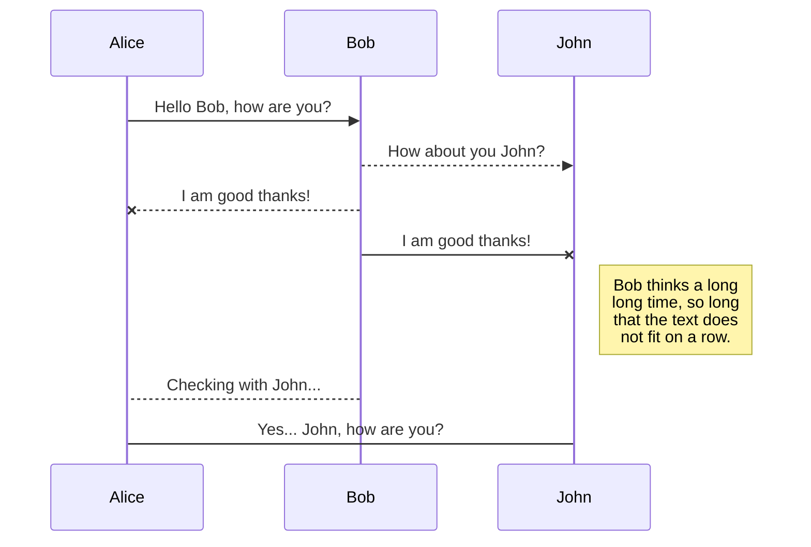

# 50.531 Secure Software Engineering Final Project report


Version:1.0 StartHTML:000000239 EndHTML:000030252 StartFragment:000003299 EndFragment:000030168 StartSelection:000003458 EndSelection:000030164 SourceURL:https://github.com/DarrenAscione/bankwebapp/blob/master/bankwebapp/README.md bankwebapp/README.md at master · DarrenAscione/bankwebapp

# [](#secure-banking-application--with-java-servlet)Secure Banking Application with Java Servlet

## [](#contents)Contents
- [Project Architecture](#Arc)
- [Introduction](#Introduction)

- [USE Case/Diagrams](#USECase/Diagrams)
- [System Functionality](#SystemFunctionality) 
	- [Transactions](#Transactions) 
	- [Batch Transactions](#Batch) 
	- [Security Implementations](#Security) 
- [Testing and Analysis](#Testing)
	- [Static](#Static)
		- [Coverity](#Coverity)
	- [jUnit](#junit)
	- 
    


# [](#Arc)Project Architecture


```

├── _apache-tomcat-9.0.7
|   └── webapps
|       └── data
├── _src
|   ├── main
|   |   ├── java
|   |   |   ├── commons
|   |   |   |   ├── Contants.java
|   |   |   |   ├── Helper.java
|   |   |   |   ├── ServiceException.java
|   |   |   |   └── StringUtils.java
|   |   |   ├── model
|   |   |   |   ├── AbstractIdEntity.java
|   |   |   |   ├── ClientAccount.java
|   |   |   |   ├── ClientInfo.java
|   |   |   |   ├── ClientTransaction.java
|   |   |   |   ├── Role.java
|   |   |   |   ├── TransactionStatus.java
|   |   |   |   ├── User.java
|   |   |   |   ├── UserRole.java
|   |   |   |   └── UserStatus.java
|   |   |   ├── service
|   |   |   |   ├── AbstractDAOImpl.java
|   |   |   |   ├── ClientAccountDAO.java
|   |   |   |   ├── ClientAccountDAOImpl.java
|   |   |   |   ├── ClientInfoDAO.java
|   |   |   |   ├── ClientInfoDAOImpl.java
|   |   |   |   ├── ClientTransactionDAO.java
|   |   |   |   ├── ClientTransactionDAOImpl.java
|   |   |   |   ├── EmailService.java
|   |   |   |   ├── EmailServiceImp.java
|   |   |   |   ├── TransactionCodesDAO.java
|   |   |   |   ├── TransactionCodesDAOImpl.java
|   |   |   |   ├── UserDAO.java
|   |   |   |   ├── UserDAOImpl.java
|   |   |   |   ├── UserRoleDAO.java
|   |   |   |   └── UserRoleDAOImpl.java
|   |   |   └── servlet
|   |   |       ├── ClientDashboardServlet.java
|   |   |       ├── DefaultServlet.java
|   |   |       ├── FileUploadServlet.java
|   |   |       ├── LoginServlet.java
|   |   |       ├── NewTransactionServlet.java
|   |   |       ├── RegisterServlet.java
|   |   |       ├── ServletPaths.java
|   |   |       ├── StaffDashboardServlet.java
|   |   |       └── TransactionCodeGenerator.java          
|   |   ├── _resources
|   |   └── _webapp
|   |       ├── resources
|   |       |   └── js
|   |       |       ├── login.js
|	|		|       ├── register.js
|	|		|       └── transaction.js
|	|		├── WEB-INF
|	|		|   ├── jsp
|	|		|   |   ├── clientDashboard.jsp
|	|		|   |   ├── errorMessage.jsp
|	|		|   |   ├── header.jsp
|	|		|   |   ├── login.jsp
|	|		|   |   ├── newTransaction.jsp
|	|		|   |   ├── pageHeader.jsp
|	|		|   |   ├── register.jsp
|	|		|   |   ├── staffDashboard.jsp
|	|		|   |   └── welcome.jsp
|	|		|   └── web.xml
|	|		└── index.jsp
| └── test
├── pom.xml
└── README.md

```

# [](#Introduction)Introduction 
This report documents our work for the **50.531 Secure Software Engineering ** final project. In this project, we were distributed a running but incomplete web application for a bank - _bankwebapp_. This project is coded in _java_, using the _IntelliJ_ environment on the _Apache Tomcat 8.0_ server as _localhost_. The distributed project allows users to _register_ accounts and _login_. Additionally, there is a default username, _staff_1_ with administrative privileges. The key objectives for this project are

1. Completion of the functionalities including transactions and batch transactions
2. Implementation of security features
3. Testing the project's source codes for defects
4. Testing the project's source codes for vulnerabilities.

Additionally, we will apply USE cases and USE case diagrams to show demonstrate our direction and logic flow.


# [](#USECase/Diagrams)USE Case / Diagrams
We have generated the following *USE cases*. 

//Hang on, let me revise my USE cases and diagrams. I'll update by tomorrow.


# [](#SystemFunctionality)System Functionality

### [](#Transactions)Transactions
//your stuff here
### [](#Batch)Batch transaction
//your stuff here
### [](#Security)Security Improvements
//your stuff here

# On boarding new user
One of the key features we have implemented beyond the scope of the deliverables and rubrics we have added is a stringent requirement for registration credentials. We would require that for registration, users

1. Use a password with at least one uppercase, one digit (0-9), one symbol and at least 8 characters long. 
2. Use a valid email address.

Users would require a valid username, password and email address for login. As these are standard security implementations adopted by most public platforms, we opine that it was a good practice to implement this for our project as well. You may refer to the _Security Implementations_ section below for a full discussion.


# Testing and Analysis
### [](#overview)Overview

**unit testing** is a software testing method by which individual units of source code, sets of one or more computer program modules together with associated control data, usage procedures, and operating procedures, are tested to determine whether they are fit for use.

A unit test should test functionality in isolation. Side effects from other classes or the system should be eliminated for a unit test, if possible. Hence as such, with this definition in mind, the proper way of writing unit test cases should be applied. Code coverage provides a good insight as to how much testing has been done throughout the application. Several various unit testing techniques were applied, including parameterised testing, etc.

## [](#Static)Static Analysis 
Static analysis refers to the analysis of computer programs without actual execution. Typically, the uses of static analysis range from detecting coding errors to verifying formal methods. For our purposes, static analysis aids us in finding code vulnerabilities and security defects. We have adopted _Coverity Scan_ as our static analysis tool.

### [](#Coverity)Coverity Scan
To use Coverity Scan, we download their _zip_ package _cov-analysis-win64-2017.07.zip_ from https://scan.coverity.com/download?tab=java. The procedure requires two main steps:

1. Register an account and the project at their website https://scan.coverity.com/. Users may also login with their _Github_ user credentials.
2. Build the project log via the said zip package above. This step less trivial, and requires more time to set up. The coverity website instructs us to first to add the \bin directory in the zip package to our _path_. To do this, we run the _Edit the system environment variables_ utility in the _Windows Control Panel_. We would also need to add the _Apache Maven_ tool and _Java Development Kit_(JDK (not JRE)) compiler to to system path. Finally, we access the bankwebapp project directory with a _cmd_ shell, and use `mvn clean` to clean up undesirable units or steps and `cov-build --dir cov-int mvn -DskipTests=true compile` to build logs. A folder _cov-int_ will be added to the project directory. We compress this folder, and upload it to https://scan.coverity.com/projects/project_link?tab=overview . 

We would then obtain the following summary.

//still figuring out how to upload images. 
It will require up to 48 business hours to receive the full report.

## [](#junit)jUnit 


As mentioned above, a unit test should test functionality in isolation. As such setter and getter methods are often if not always incorrectly written. A unit test method for a setter function should not call its corresponding getter method when applying assertion. This is also true for a test on the getter function. Because of this, the following test case has been written to demonstrate how proper unit testing should be carried out.

// How to properly test a getter function without calling a setter
@Test  
public void getUser() throws NoSuchFieldException, IllegalAccessException {  
  final Field field = clientAccount.getClass().getDeclaredField("user");  
  field.setAccessible(true);  
  field.set(clientAccount, new User(12));  
 final User result = clientAccount.getUser();  
 final int id = result.getId();  
  assertEquals("field wasn't retrieved properly", id, 12);  
}

In the `getUser()` test class, we first set a variable `field` where we are getting the field value `user` which is a private variable in the `ClientAccount` model and is accessed and set through it's `getUser()` and `setUser()` methods. Because we are testing on the getter method, based on the principles of unit testing, it would not be correct to call a `setUser()` method in this test case. We can however se this field `field.setAccesible(true)` as `true` and this would allow us to set the corresponding field which in this case is `user` as `field.set(clientAccount, new User(12));`. From here, we can finally apply the method we are testing for which is `clientAccount.getUser()` and apply an assertion to see if these values matches.

// How to properly test a setter function without calling a getter
@Test  
public void setUser() throws NoSuchFieldException, IllegalAccessException {  
  //when 
  clientAccount.setUser(new User(12));  
  
  //then 
  final Field field = clientAccount.getClass().getDeclaredField("user");  
  field.setAccessible(true);  
  assertEquals("Fields didn't match", field.get(clientAccount), 12);  
}

Likewise, the above code shows how a proper test case for a setter function should be written.

Each of the Java classes in the Model module has a corresponding getter and setter method that must be tested as shown above. These test cases have been written and you can refer them in the following directory: `<BANKWEBAPP>/src/test/java/sg.edu.sutd.bank.webapp/model`.


-------------------------------------------------------------------------------------------
-------------------------------------
# //for references (will delete last)
# Markdown extensions

StackEdit extends the standard Markdown syntax by adding extra **Markdown extensions**, providing you with some nice features.

> **ProTip:** You can disable any **Markdown extension** in the **File properties** dialog.


## SmartyPants

SmartyPants converts ASCII punctuation characters into "smart" typographic punctuation HTML entities. For example:

|                |                          |HTML                         |
|----------------|-------------------------------|-----------------------------|
|Name|Register            |'Isn't this fun?'            |
|Objectives          |To register account in SUTD Bank         |"Isn't this fun?"            |
|Pre-conditions          |`User must have existing email address
|-- is en-dash, --- is em-dash|
|Post-conditions|
|Actors|
|Trigger|
|Normal flow|
|Alternative flow|
|Interacts with|


## KaTeX

You can render LaTeX mathematical expressions using [KaTeX](https://khan.github.io/KaTeX/):

The *Gamma function* satisfying $\Gamma(n) = (n-1)!\quad\forall n\in\mathbb N$ is via the Euler integral

$$
\int_0^\infty x^2 sin x   dx
$$

$$
\Gamma(z) = \int_0^\infty t^{z-1}e^{-t}dt\,.
$$

> You can find more information about **LaTeX** mathematical expressions [here](http://meta.math.stackexchange.com/questions/5020/mathjax-basic-tutorial-and-quick-reference).


## UML diagrams

You can render UML diagrams using [Mermaid](https://mermaidjs.github.io/). For example, this will produce a sequence diagram:



And this will produce a flow chart:

```mermaid
graph LR
A[Square Rect] -- Link text --> B((Circle))
A --> C(Round Rect)
B --> D{Rhombus}
C --> D


X[Square Rect] -- Link --> B((Circle))
Y((Holy shit)) -- extend --> 


